# How the theme factory works

We ship 50+ visually distinct WooCommerce storefronts from one codebase. Each theme inherits the same hard-won plumbing — 77 structural invariants, a11y gates, cross-theme uniqueness checks, per-theme WC override layers — while painting its own voice on every shopper-facing surface. Adding a new theme is a few-minute workflow that ends in a live, shareable demo link; design, structural, and visual regressions are all gated automatically.

## The factory floor

```mermaid
flowchart LR
    classDef stage  fill:#f6f3ee,stroke:#1c1711,stroke-width:2px,color:#1c1711
    classDef heal   fill:#fde7d6,stroke:#8b2f1f,stroke-width:2px,color:#1c1711
    classDef ship   fill:#e6efe2,stroke:#2F7A4D,stroke-width:2px,color:#1c1711
    classDef red    stroke:#b33a3a,stroke-width:2px,color:#b33a3a

    subgraph IDEATE["① Ideate"]
        direction TB
        CS[concept_seed.py<br/>50+ concept cards:<br/>palette · type · voice tags]
        MOCK[mockups/&lt;slug&gt;.png<br/>two-view browser mockup]
        CS --> MOCK
    end

    subgraph DESIGN["② Design"]
        direction TB
        SPEC[concept-to-spec.py<br/>→ spec.json]
        BUILD[design.py <b>build</b><br/>clone Obel · swap tokens ·<br/>seed Playground · sync blueprint]
        DRESS[design.py <b>dress</b><br/>microcopy · photography ·<br/>front-page restructure]
        SPEC --> BUILD --> DRESS
    end

    subgraph VERIFY["③ Verify"]
        direction TB
        CHECK[bin/check.py<br/>77 static invariants<br/>rules #1–23]
        SNAP[bin/snap.py<br/>boot Playground locally ·<br/>Playwright × 4 viewports × 30 routes ·<br/>axe · DOM heuristics]
        VISION[snap-vision-review.py<br/>Claude vision vs.<br/>theme's design-intent.md]
        CHECK --> SNAP --> VISION
    end

    subgraph HEAL["④ Self-heal"]
        direction TB
        WATCH[design-watch.py<br/>live STATUS.md feed]
        UNBLOCK[design_unblock.py<br/>classify blocker →<br/>evidence packet →<br/>LLM edit → verify → iterate]
        WATCH --> UNBLOCK
    end

    subgraph SHIP["⑤ Ship"]
        direction TB
        BASE[tests/visual-baseline/&lt;slug&gt;/<br/>committed PNGs + findings]
        CI[GitHub Actions<br/>check · visual · vision-review ·<br/>first-baseline · quick-visual]
        PAGES[demo.regionallyfamous.com/&lt;slug&gt;/<br/>short-URL → Playground deeplink]
        BASE --> CI --> PAGES
    end

    MOCK --> SPEC
    DRESS --> CHECK
    VISION --> BASE
    VISION -. red .-> UNBLOCK
    UNBLOCK -. re-verify .-> CHECK

    class IDEATE,DESIGN,VERIFY stage
    class HEAL heal
    class SHIP ship
```

## The five stages

### ① Ideate
A concept seed in `bin/concept_seed.py` encodes a palette (four to six hex values), a type specimen, and a handful of voice tags. `bin/paint-mockup.py` turns that seed into a two-view browser mockup — homepage + shop — at a fixed 1376×768 aspect so every concept card lays out identically in the public queue at [`demo.regionallyfamous.com/concepts/`](https://demo.regionallyfamous.com/concepts/).

### ② Design
`bin/concept-to-spec.py` distills the concept into a machine-readable `spec.json`. `bin/design.py build` then deterministically:
- clones the canonical theme (`obel/`) into `<slug>/`,
- swaps every design token across `theme.json` (colors, fonts, spacing, shadows, radii),
- seeds a per-theme WooCommerce demo catalog (30 products, 6 categories, pages, posts, imagery),
- inlines the shared PHP helpers into the theme's Playground blueprint.

`build` ends when the theme **renders**. `dress` then runs the judgment-heavy passes: microcopy rewritten in the theme's voice, product photography swapped for per-theme imagery, the front-page layout restructured so no two themes share a composition fingerprint.

### ③ Verify
Three layers, loudest first:
- **`bin/check.py`** — 77 static invariants. Example rules: no `!important`, only `core/*` and `woocommerce/*` blocks, unique shopper-visible strings across themes, per-theme chrome on every WC card surface, no default-WooCommerce microcopy leaks, product photos visually distinct within and across themes, hover states ≥3:1 contrast, view transitions wired end-to-end.
- **`bin/snap.py`** — boots the theme in WordPress Playground locally (no WP install required), drives Playwright across four viewports × thirty routes (home, shop, category, product-simple, product-variable, cart-empty, cart-filled, checkout, my-account, journal, 404…), and captures PNG + HTML + axe-core a11y + DOM heuristics (overflow, duplicate nav, region-void, tap-target, broken background images).
- **`bin/snap-vision-review.py`** — hands each rendered PNG to Claude with the theme's own `design-intent.md` rubric. Findings land alongside axe errors in the same `findings.json` pipeline, so a "typography overpowered" pixel critique triages identically to an a11y violation.

### ④ Self-heal
When verification goes red, `bin/design_unblock.py` steps in:
1. **Classify** — parse every finding into a stable blocker category (`microcopy-duplicate`, `hover-contrast`, `photo-collision`, `vision-overpowered`, …).
2. **Build an evidence packet** — relevant file slices, the exact rule that fired, the rendered screenshot, the theme's design-intent rubric, and fingerprints so the same blocker isn't re-attempted.
3. **Hand it to an LLM** — Claude proposes a JSON edit plan (path + old_string + new_string per edit) under strict guardrails: no edits outside the theme slug, no `!important`, no framework files.
4. **Apply + verify** — the patch lands, a scoped re-run of `check.py` / `snap.py` proves the blocker is gone, and the loop either continues to the next blocker or stops when green.

`bin/design-watch.py` streams the whole loop to a live `STATUS.md` dashboard so a human can watch (or intervene) in real time. Every attempt — decision, reasoning, files touched, verification outcome — is persisted to `repair-attempts.jsonl` for audit.

### ⑤ Ship
Visual baselines live at `tests/visual-baseline/<slug>/` — the canonical rendered PNG for every (viewport, route) cell, committed to the repo. GitHub Actions runs the same static gate on every PR (scoped to changed themes), a pixel-diff against the baselines, and a vision pass on any PR that adds a brand-new theme. On green merge, the theme lands at [`demo.regionallyfamous.com/<slug>/`](https://demo.regionallyfamous.com) — a short URL that redirects to a WordPress Playground deeplink, so anyone on the internet can click through a fully-seeded WooCommerce storefront without touching a real WordPress install.

## Why it's cool

Three things that aren't usually in the same pipeline:

1. **Spec-driven, not template-driven.** Every theme is a deterministic token swap off one canonical ancestor. No `if brand == 'X'` forks, no copy-paste drift. Change a structural rule in the ancestor and every theme inherits it.
2. **Pixel-verified, not just test-passing.** An LLM reviews rendered screenshots against a rubric the theme itself declared, and the resulting findings are first-class alongside axe-core and static checks. "The H1 crushes the hierarchy" fails CI the same way "`<html>` missing `lang` attribute" does.
3. **Self-healing, not just red-light/green-light.** Most CI pipelines stop at red. Ours structures the failure into an evidence packet an LLM can actually act on, applies the fix, and re-verifies — usually before a human has finished reading the notification.

The net effect: the cost of shipping the 50th theme is the same as shipping the first.

## Where to go next

- **Bootstrap**: [`../AGENTS.md`](../AGENTS.md) — the operator manual (23 hard rules + tooling).
- **Shipping one**: [`./shipping-a-theme.md`](./shipping-a-theme.md) — per-theme checklist.
- **Shipping many**: [`./batch-playbook.md`](./batch-playbook.md) — N-at-a-time workflow.
- **Public bench**: [`/concepts/`](https://demo.regionallyfamous.com/concepts/) — the queue of painted concepts.
- **Shipped themes**: [`/themes/`](https://demo.regionallyfamous.com/themes/) — live dashboard with stage + gate claims per theme.
- **Snap gallery**: [`/snaps/`](https://demo.regionallyfamous.com/snaps/) — the retina baseline gallery, organised by theme × viewport × route.
