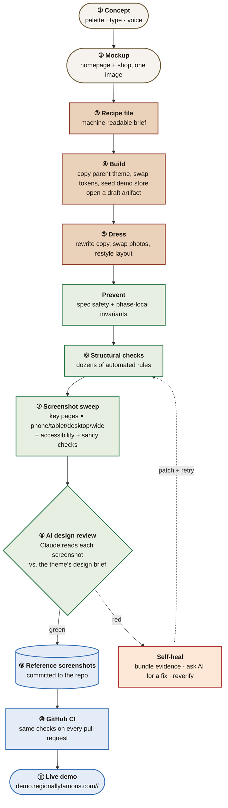

# How the theme factory works

We build online stores on WordPress. Lots of them. They all look different — different colors, different typefaces, different voice — but they come out of the same codebase. This is how.

Every theme is a full WooCommerce store: product pages, shopping cart, checkout, customer accounts, an order confirmation flow, a blog. The visible style changes from theme to theme; the underlying structure and every automated safety check is shared. Adding a new theme takes a few minutes and ends with a live link anyone on the internet can click.

## The factory floor

## The five stages

### ① Ideate — decide what the next theme should look like

Each theme starts as a **concept card**: a small recipe that says "here are the colors, here's the typography, here's the voice." We paint each concept as a single image showing a homepage and a shop page side by side, so we can see at a glance what the finished store will feel like before any code exists. Every concept card lives on a public queue at [demo.regionallyfamous.com/concepts/](https://demo.regionallyfamous.com/concepts/).

### ② Design — turn the concept into a real website

A small script reads the concept card and writes a machine-readable brief. Before any files are created, the spec is checked for known bad inputs — for example a text color that cannot contrast with the background, or a theme accidentally trying to clone itself. The `build` step then runs through a checklist:

- make a fresh copy of our canonical "parent" theme (named Obel),
- swap in the new theme's colors, fonts, spacing, shadows and corner radii,
- populate a demo store with 30 products across 6 categories, plus a few blog posts and photos,
- wire up a one-click live-preview link.

At this point the theme renders — it's a working store, it just looks like our parent theme with different colors. In batch mode this is enough to open a draft pull request, so even a later failure leaves a branch and a visible artifact instead of an invisible half-run. The next step, `dress`, is the judgment-heavy part: rewriting every piece of copy in the new theme's voice, replacing placeholder product photos with brand-appropriate imagery, and restructuring the homepage layout so no two themes feel the same when you browse them back-to-back.

### ③ Verify — make sure it actually works and looks right

Three layers, in increasing order of subtlety:

1. **Prevention checks.** Cheap, deterministic rules run early: spec safety before cloning, then phase-local invariants after clone, apply, seed, photos, microcopy, and the other generator phases. Known failure categories live in a shared prevention catalog so `design.py`, the rescue loop, the batch runner, and the tests agree on where a mistake should be stopped next time.
2. **Structural checks.** Dozens of automated rules catch concrete things like *"don't reuse the same sentence across two themes"*, *"hover states must have enough contrast to stay legible"*, *"every theme must paint its own cart sidebar, not inherit a shared default"*, *"no two product photographs may look identical"*. Every rule exists because we hit that specific bug at least once.
3. **Screenshot + accessibility sweeps.** We spin up a temporary WordPress + WooCommerce site *in the browser* (no real install needed, using the Playground runtime), then take screenshots of the important storefront routes — home, shop, cart, checkout, account, product pages, journal, 404, and interaction states — across the responsive matrix. Full runs use phone, tablet, laptop, and wide desktop; quick proof runs can deliberately shoot just phone and desktop. While the site is up we also run an accessibility audit (the same [axe-core](https://github.com/dequelabs/axe-core) that Chrome DevTools uses) and a handful of sanity checks: is any text overflowing its container? Are there two identical navigation menus on one page? Did any background image fail to load?
4. **AI design review.** Each screenshot is handed to Claude along with the design brief for that theme, and the model writes critique like *"the hero headline is too big and crushes the product grid underneath"* or *"the payment icons collide with the checkout sidebar on mobile"*. Those comments land in the same place as the accessibility findings and get treated the same way — a design critique can fail the build just like a missing `alt` attribute can.

### ④ Self-heal — fix the problems automatically

If anything from the verify step comes back red, the system tries to fix it before asking for help.

1. **Sort.** Each problem is classified into a known category: *"microcopy duplicates another theme"*, *"hover contrast too low"*, *"two product photos look the same"*, *"AI reviewer thinks the hero is overpowering"*, and so on.
2. **Pack.** The evidence is bundled up — the relevant source files, the exact rule that fired, the offending screenshot, the theme's design brief — into a package an AI can actually reason about.
3. **Ask.** The bundle goes to Claude, which proposes a specific, minimal patch (exact file, exact replacement text) under strict guardrails: no `!important`, no edits outside the theme's own folder, no touching shared framework code.
4. **Apply, re-verify, and promote.** The patch lands, the affected checks re-run, and the loop either moves on to the next problem or stops when everything is green. If the fix reveals a mistake the factory itself should never make again, the run records a factory defect with an owner, prevention layer, and test fixture. Batch PRs stay draft until those preventable failures are promoted into deterministic tooling, or are explicitly allowed as report-only. After a bounded number of attempts the loop escalates for human help rather than spinning forever.

A companion process writes a live status file so a human can watch the loop work in real time — current phase, screenshot progress, active blocker, every repair attempt, and every file touched are logged for later audit.

### ⑤ Ship — put the theme online

Once everything is green, the reference screenshots get committed to the repo alongside the code. GitHub runs the same checks on every pull request, verifies the branch, and compares the new screenshots against committed references; any regression blocks the merge. Batch PRs are marked ready and auto-merge is armed only after verification passes. On a successful merge, the theme appears at `demo.regionallyfamous.com/<slug>/` — a short link that opens a live, fully-seeded version of the store in anyone's browser. No WordPress install required; the whole thing runs inside Playground, WordPress's in-browser runtime.

## Why it's interesting

Three things that don't usually live in the same system:

1. **One recipe, many flavors.** Every theme starts as a mechanical copy of one canonical parent with the design decisions swapped. Theme-specific taste lives in the theme's own tokens, templates, copy, images, and scoped chrome; shared framework code stays generic. Change a structural rule in the parent or generator and every future child inherits the change — including the safety checks.
2. **Pixel-verified, not just test-passing.** It's not enough for the code to compile and the automated tests to pass. An AI that can actually *see* the rendered pages grades them against the design brief, and its findings count the same as the mechanical ones. "The headline swallows the page" fails the build just like "missing alt text on a button" does.
3. **Self-healing, not just red-light / green-light.** Most build systems stop at "this is broken." Ours structures the failure into something an AI can act on, proposes a specific fix, applies it, and rechecks — usually before a human has finished reading the notification.

The combined effect: the cost of shipping the next theme is the same as the last — whether that's the tenth or the ten-thousandth.

## Where to go next

- **Operator manual** — [AGENTS.md](../AGENTS.md) — 23 hard rules + the tooling reference.
- **Shipping one theme** — [shipping-a-theme.md](./shipping-a-theme.md) — the per-theme checklist.
- **Shipping many at once** — [batch-playbook.md](./batch-playbook.md) — the N-at-a-time workflow.
- **Public concept queue** — [/concepts/](https://demo.regionallyfamous.com/concepts/) — every painted concept, queued up.
- **Shipped themes** — [/themes/](https://demo.regionallyfamous.com/themes/) — live dashboard with each theme's stage and passing-checks.
- **Screenshot gallery** — [/snaps/](https://demo.regionallyfamous.com/snaps/) — the committed reference screenshots, browseable by theme × screen size × page.

